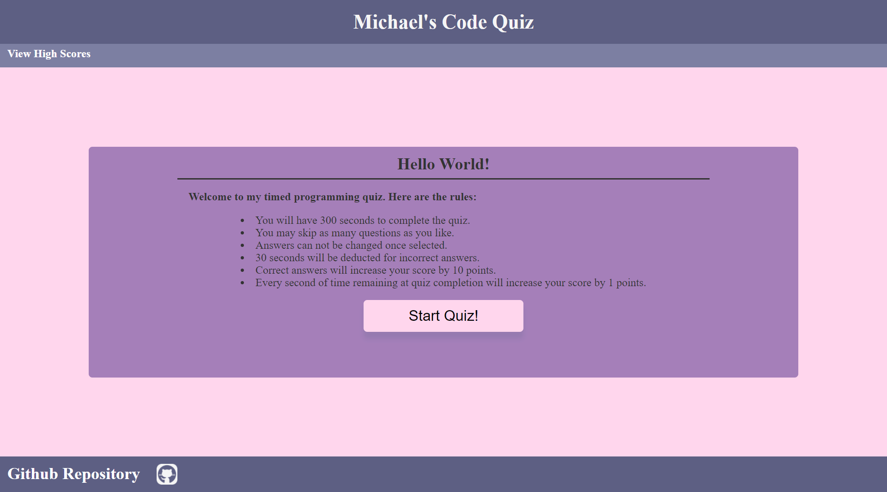

# Code Quiz

For this challenge, I was tasked with creating a timed coding quiz from scratch. This page is fully responsive, meaning you can enjoy this user interface on any device.

On page load, the user is presented with the rules of the quiz. Beginning the quiz starts a timer and presents a series of multiple choice questions. Incorrect answers decrease the time remaining. Users are able to save their scores to local storage upon completion of the quiz.

Deployed site is viewable <a href="https://michael-rodriguez22.github.io/WEB-API-CHALLENGE-code-quiz/">here</a>. Enjoy!

***

